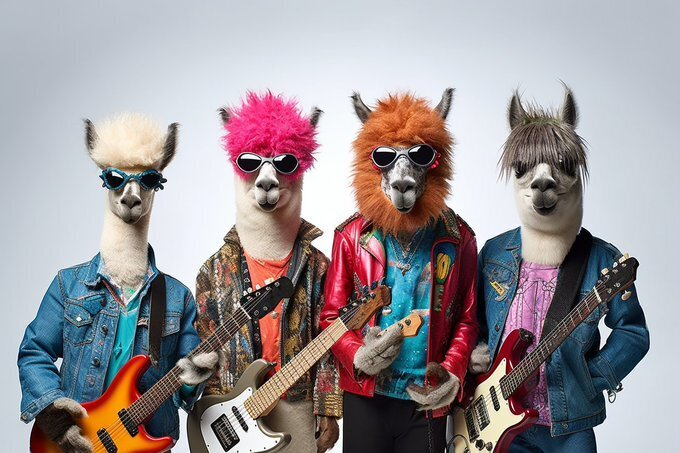
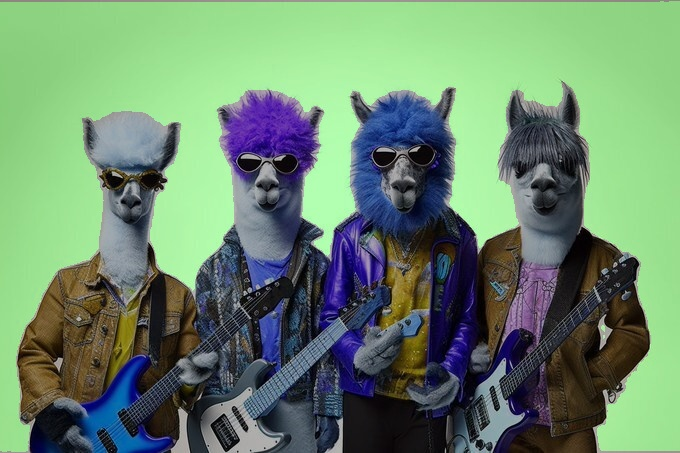

# Python Bindings for [sam.cpp](https://github.com/YavorGIvanov/sam.cpp)

## Installation

### From pypi

```sh
pip install sam-cpp-python
```

### From source

```sh
git clone https://github.com/neka-nat/sam-cpp-python.git
cd sam-cpp-python
pip install .
```

## Example

```py
import cv2
import numpy as np

import sam_cpp

image = cv2.imread("img.jpg")
image = cv2.cvtColor(image, cv2.COLOR_BGR2RGB)

predictor = sam_cpp.create_sam_predictor()
predictor.set_image(image)
masks = predictor.predict(np.array([10, 10], dtype=np.float32))
green_mask = np.zeros_like(image)
green_mask[:, :, 1] = masks[0]

masked_image = cv2.addWeighted(image, 0.7, green_mask, 0.3, 0)
cv2.imwrite("masked_image.jpg", masked_image)
```

## Result



